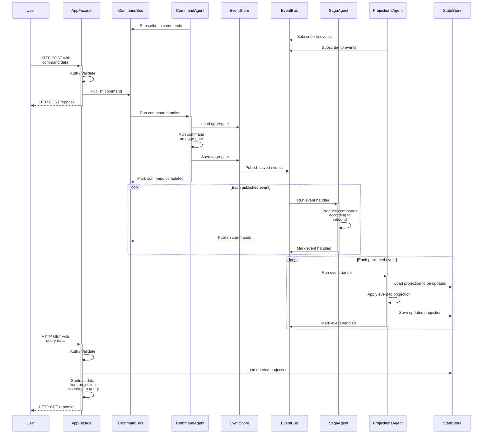
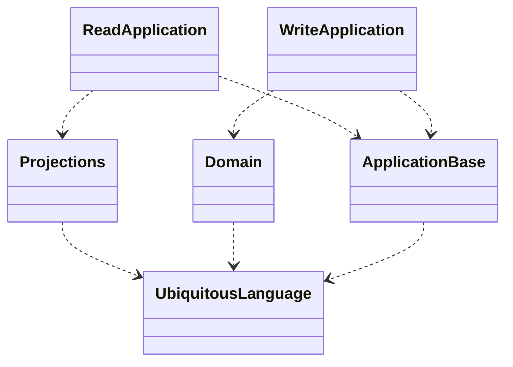

# Repository

Это репозиторий с кодом, автотестами и документацией фреймворка Cleanic.  
На основе фреймворка Cleanic можно писать бизнес-софт; приложения,автоматизирующие бизнес.  

В папке `src` код фреймоврка. А в папке `specs` автотесты, называющиеся тут спецификациями (отсылка к Specification By Example Гойко Аджича).  
Начинать знакомство с фреймворком лучше всего со спецификаций. Помимо кода автотестов, там есть ещё и документация.  

Автор идеи – @truezanuda.  
Если хотите использовать фреймворк для написания своих приложений, пожалуйста, лицензия позволяет.  
Если хотите внести свой вклад, будем рады видеть его в виде комментов, вопросов и пулл-реквестов.

# Cleanic

Цель создания фреймворка – облегчить/ускорить разработку бизнес-приложений. Не любых. А тех, где ключом к успеху продукта является скорость и цена разработки и не является быстродействие приложения.
Принципы, которые обеспечивают достижение цели:
- DDD, а именно стратегическая его часть.
    - Фреймворк написан так, что разработчикам легче использовать общий язык, чем не использовать или чем использовать несколько языков (как это обычно происходит в ентерпрайз-разработке). Предметка – это самая большая сложность в ентерпрайз мире и самая частая причина плохого качества автоматизации: спроектировали без участия экспертов, потом в проде выяснилось, что коряво, но в этот момент разработчики не могут обосновать бизнесу, что надо переписывать (а код написан так, что изменить предметку, не трогая остальное не получается). Поэтому корявость предметки пытаются исправить добавлением частных случаев. Это в свою очередь задирает вверх кривую зависимости цены изменений от возраста кодовой базы.
- BDD, в особенности на верхнем уровне пирамиды.
    - Чтобы не делать лишнего, прежде чем что-то реализовывать, с предметниками и тестировщиками моделируется будущий функционал. Модель в виде сценариев использования служит и критерием приёмки, и формулировкой задач. Эти сценарии – основа коммуникации с разработчиками.
- Clean Architecture.
    - На каждом из трёх слоёв кодовой базы программируется свой аспект работы приложения. В `Core` не программируется ничего, кроме общего языка и логики обработки команд. В `Application` только логика работы приложения независимо от функционала. `Framework` это только интеграция приложения с внешними системами. Таким образом, можно сажать узких специалистов по БД за работу над слоем фреймворк и они даже знать ничего не будут про функционал приложения. И также можно сажать системных аналитиков за программирование бизнес-логики в слое кор, им никогда не придётся воспользоваться ни одной библиотекой, достаточно пройти базовый курс по C#.

## How to develop with Cleanic
По BDD, сначала вместе с доменным экспертом составляем сценарий использования системы. Потом этот сценарий программируем и получаем автотест. Чтобы автотест отличался от человеческого сценария как можно меньше, в клинике есть библиотека для написания поведенческих тестов. Она предполагает, что в сценарии будут упоминаться клиентские приложения и пользователь будет через них отправлять команды и запрашивать вьюхи. То есть, в тесте смешаны два языка: язык приложения (из билиотеки для написания слоя Application) и доменный язык (из библиотеки для написания слоя Core).
> Мы долго сопротивлялись естесственному желанию смешать эти два языка, и пытались использовать только доменный, как это рекомендуют в теории (или мы сами незаметно загнали себя в эти рамки...). Главная неестесственность была в том, что доменные эксперты в действительности разговаривают на языке приложения; он им нужен, чтобы представить эту будущую реальность, в которой приложение уже написано и внедрено. Однако нужно следить, чтобы не появлялись слова из языка слоя Framework; этот язык для разработчиков – язык ограничений. Когда бизнес начинает на нём говорить, он навязывает свой вариант реализации приложения.

Определить и запрограммировать сценарий не получится без определения доменного языка. Языка приложения хватит стандартного, из клиника, а доменный язык будет свой, на основе понятий из клиника. Эти понятия такие:
Команда описывает намерение актора что-то изменить в текущем состоянии предметной области. В ответ на команду возникают доменные события (не путать с событиями event sourcing).
Запрос описывает намерение актора что-то узнать о текущем состоянии предметной области. В ответ на запрос система даёт вью, описывающую запрошеный кусок состояния предметки.

Получив и запрограммировав сценарии, можно настраивать CI с их запуском или запускать из локально и начинать реализовывать приложение, которое обеспечит описанное поведение.
Приложение будет состоять из двух частей: обработка команд, write-side; и подготовка вьюх и их выдача по запросу, read-side.
Для врайт-части нужно запрограммировать доменные правила в виде агрегатов с обработчиками команд.
Для рид-части нужно запрограммировать прожекторы, строящие вьюхи на основе состояния агрегатов. Поскольку агрегаты ивент-сорсед, то прожекторы обновляют вьюхи с каждым возникшем во врайт-части ивент-сорсед событием.
После этого сценарии уже будут работать, тестовый фреймоворк будет запускать их на специальной обвязке (слой фреймворк), исполняющей приложение в памяти.

## Authorization
Доступ даём на команды и запросы.
В админке для упрощения можно дать сразу на весь агрегат.
Для каждого "права доступа" помимо команды/запроса может указываться идентификатор агрегата. Если надо разграничить доступ по экземплярам.

Framework for building a business service inspired by [Uncle Bob's "The Clean Architecture"](https://blog.cleancoder.com/uncle-bob/2012/08/13/the-clean-architecture.html).

## Server interaction pattern

## Assembly relations
