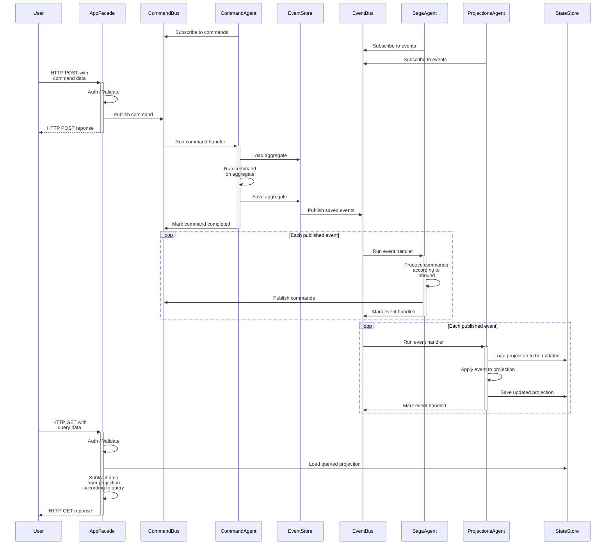
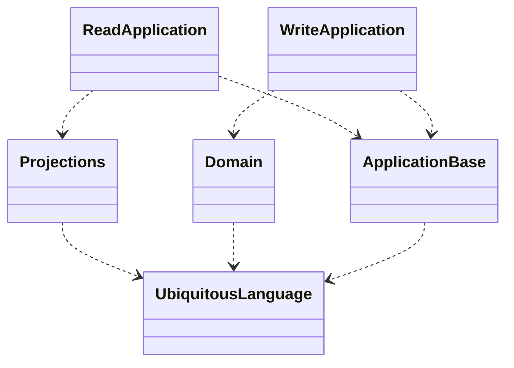

# Cleanic

Framework for building a business service inspired by [Uncle Bob's "The Clean Architecture"](https://blog.cleancoder.com/uncle-bob/2012/08/13/the-clean-architecture.html).

## Server interaction pattern

## Assembly relations
